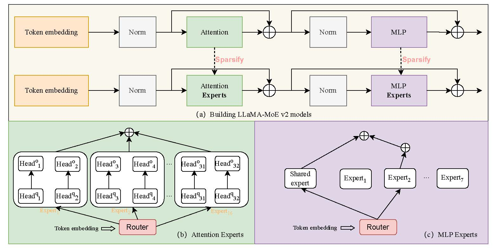

<div align="center">
  <h1>LLaMA-MoE v2: Exploring Sparsity of LLaMA from Perspective of Mixture-of-Experts with Post-Training</h1>
  <br />
  <span style="color:red">📢 <strong><i>A SMALLER AFFORDABLE MoE MODEL FOR EVERYONE!!</i></strong></span>
  <div>
    <a href="https://huggingface.co/LLaMA-MoE-v2" target="_blank">🤗 Model Weights</a> | <a href="#quick-start">🚀 Quick Start</a> | <a href="#installation">⚙️ Installation Guide</a> | <a href="#expert-construction">🚧 Expert Construction</a> | <a href="#sft">💬 Supervised Fine-Tuning (SFT)</a> | <a href="#evaluation">💎 Evaluation</a>  <br /> 
    <a href="https://arxiv.org/pdf/2411.15708" target="_blank" style="display: inline-block; margin-top: 10px;"> 📃 Technical Report </a>
  </div>
</div>


<h2 id="updates">🚀 Updates</h2>

📆[2024-12-03] 🎈 We scale the training data to 8.4B token and release the new MLP-MoE (8top2) model. The new model can achieve near 59.6 on GSM8K and 57.1 on HumanEval.  


<h2 id="llama-moe">🎉 Introduction</h2>

LLaMA-MoE-v2 is a series of open-sourced Mixture-of-Expert (MoE) models based on [LLaMA3](https://github.com/facebookresearch/llama).
We build LLaMA-MoE-v2 with the following two steps:
1. **Partition** LLaMA's FFN layers or Attention layers into sparse experts and insert top-K gate for each layer of experts.
2. Supervised fine-tuning the constructed MoE models using open-source data with a two-stage training.



<h2 id="features">🔥 Features</h2>

1. **Support building Attention MoE and MLP MoE**:
   1. build Attention MoE models with attention layers
   2. build MLP MoE models with MLP layers
2. **Multiple Expert Construction Methods**:
   1. random MLP MoE construction (vanilla)
   2. residual MLP MoE construction (residual)
3. **Packed Padding Training**
4. **Support training with megablocks**
4. **Two-stage & Open-source data for SFT**:
    <details>
    <summary>First-stage</summary>

     - [OpenHermes-2.5](https://huggingface.co/datasets/teknium/OpenHermes-2.5)
     - [SlimOrca](https://huggingface.co/datasets/Open-Orca/SlimOrca)
     - [sharegpt_gpt4](https://huggingface.co/datasets/shibing624/sharegpt_gpt4)
     - [lima](https://huggingface.co/datasets/GAIR/lima)
     - [Infinity-Instruct](https://huggingface.co/datasets/BAAI/Infinity-Instruct)
     - [Llama-3-Magpie-Air-3M-v0.1](https://huggingface.co/datasets/Magpie-Align/Llama-3-Magpie-Air-3M-v0.1)

     </details>
     <details>
    <summary>Two-stage</summary>

     - [Infinity-Instruct](https://huggingface.co/datasets/BAAI/Infinity-Instruct)
     - [MetaMathQA](https://huggingface.co/datasets/meta-math/MetaMathQA)

5. **Support building MoE for different Models**

    <details>
    <summary>models</summary>

    - [Llama3-8B](https://huggingface.co/meta-llama/Meta-Llama-3-8B-Instruct)


<h2 id="quick-start">🚀 QuickStart</h2>

```python
# python>=3.10

import torch
from transformers import AutoTokenizer, AutoModelForCausalLM

model_dir = "LLaMA-MoE-v2/LLaMA-MoE-v2-3_5B-2_8"
tokenizer = AutoTokenizer.from_pretrained(model_dir, trust_remote_code=True)
model = AutoModelForCausalLM.from_pretrained(model_dir, torch_dtype=torch.bfloat16, trust_remote_code=True)
model.eval()
model.to("cuda:0")

input_text = "Suzhou is famous for?"

input_text = f"<|start_header_id|>user<|end_header_id|>\n\n{input_text}<|eot_id|><|start_header_id|>assistant<|end_header_id|>\n\n"

inputs = tokenizer(input_text, return_tensors="pt")
inputs = inputs.to("cuda:0")

pred = model.generate(**inputs, max_length=50, temperature=0.0)
print(tokenizer.decode(pred.cpu()[0], skip_special_tokens=True))
```

<h2 id="installation">⚙️ Installation</h2>

1. Prepare conda environment: `conda create -n smoe python=3.11` (If your environment name is not `smoe`, you may need to change environment in launching scripts)
2. Add correct environment variables in `~/.bashrc` (`gcc` is set to newer version for installing `flash-attn`). e.g.:
    ```bash
    export PATH=/mnt/petrelfs/share/cuda-11.8/bin:$PATH
    export LD_LIBRARY_PATH=/mnt/petrelfs/share/cuda-11.8/lib64:$LD_LIBRARY_PATH
    export PATH=/mnt/petrelfs/share/gcc-10.1.0/bin:$PATH
    export LD_LIBRARY_PATH=/mnt/petrelfs/share/gcc-10.1.0/lib64:$LD_LIBRARY_PATH
    ```
3. Take the variables into effect: `source ~/.bashrc`
4. Install PyTorch (CUDA-11.8): `pip3 install torch torchvision torchaudio --index-url https://download.pytorch.org/whl/cu118`
5. Install dependencies: `pip install -r requirements.txt`
6. Install `flash-attn`: `pip install flash-attn==2.6.1 --no-build-isolation`. You may need to follow the [flash-attn installation instructions](https://github.com/Dao-AILab/flash-attention?tab=readme-ov-file#installation-and-features) to avoid some errors.
7. Install the latest Git: `conda install git`
8. Clone the repo: `git@github.com:LLaMA-MoE/LLaMA-MoE-v2.git` (If you don't setup the ssh key to GitHub, you may not able to clone through ssh. Check the [docs](https://docs.github.com/en/authentication/connecting-to-github-with-ssh/adding-a-new-ssh-key-to-your-github-account) about it.)
9. Change current directory: `cd LLaMA-MoE-v2`
10. Install `smoe` in [editable mode](https://pip.pypa.io/en/stable/cli/pip_install/#cmdoption-e): `pip install -e .[dev]`
11. Setup `pre-commit` hooks: `pre-commit install`


<h2 id="performance">📊 Model Performance</h2>

| Model                     | \#Activated Experts | \#Experts | \#Activated Params |                      SFT Model                                  |
| :------------------------ | :-----------------: | :-------: | :----------------: | :------------------------------------: |
| **LLaMA-MLP-MoE (2/8)**  |          2          |     8     |        3.8B        | [🤗 SFT](https://huggingface.co/llama-moe/LLaMA-MoE-v2-3_8B-2_8-sft)    |
| **LLaMA-MLP-MoE (1+1/7)**|          2          |     8     |        3.8B        | [🤗 SFT](https://huggingface.co/llama-moe/LLaMA-MoE-v2-3_8B-residual-sft)  |


| Model | #Training Tokens | MMLU(5) | GSM8k(8) | HumanEval(pass@10) | IFEval | BoolQ(32) | SciQ | PIQA | ARC-c(25) | TruthfulQA | HellaSwag(10) |
|:---|:---:|:---:|:---:|:---:|:---:|:---:|:---:|:---:|:---:|:---:|:---:|
| [LLaMA3-8B](https://huggingface.co/meta-llama/Meta-Llama-3-8B-Instruct) | 15T | 67.2 | 76.5 | 71.4 | 76.5 | 83.0 | 93.2 | 78.5 | 61.9 | 51.7 | 78.8 |
| [INCITE-3B](https://huggingface.co/togethercomputer/RedPajama-INCITE-Instruct-3B-v1) | 1T | 25.1 | 2.1 | 6.92 | 30.1 | 66.5 | 94.7 | 74.4 | 40.2 | 36.4 | 65.6 |
| [Sheared-LLaMA-2.7B](https://huggingface.co/princeton-nlp/Sheared-LLaMA-2.7B-ShareGPT) | 50B | 28.2 | 1.9 | 3.2 | 28.8 | 67.6 | 75.8 | 41.1 | 47.6 | 71.2 | 39.0 |
| [Gemma-2-2b](https://huggingface.co/google/gemma-2-2b-it) | 2T | 53.0 | 26.3 | 46.1 | 34.9 | 72.3 | 75.8 | 67.5 | 52.6 | 50.8 | 69.0 |
| [Salamandra-2b](https://huggingface.co/BSC-LT/salamandra-2b-instruct) | 7.8T | 25.1 | 1.90 | 5.82 | 27.7 | 68.0 | 89.8 | 74.7 | 46.3 | 43.4 | 62.3 |
| [SmolLM2-1.7B](https://huggingface.co/HuggingFaceTB/SmolLM2-1.7B-Instruct) | 11T | 50.4 | 38.5 | 39.1 | 29.0 | 68.2 | 84.3 | 76.0 | 53.2 | 39.9 | 72.6 |
| [OpenMoE-3B-9B](https://huggingface.co/OrionZheng/openmoe-8b-chat) | 1T | 26.5 | 1.36 | 1.01 | 31.2 | 61.7 | 68.4 | 65.7 | 33.3 | 40.5 | 56.5 |
| [LLaMA-MoE-3B-7B](https://huggingface.co/llama-moe/LLaMA-MoE-v1-3_5B-2_8-sft) | 200B | 28.2 | 4.62 | 12.0 | 28.1 | 68.1 | 88.8 | 77.9 | 44.0 | 33.3 | 73.2 |
| [OLMoE-1B-7B](https://huggingface.co/allenai/OLMoE-1B-7B-0924-SFT) | 1T | 53.8 | 40.9 | 40.5 | 35.5 | 80.9 | 94.9 | 80.1 | 55.6 | 43.3 | 79.6 |
| **MLP-MoE (8top2)** | **7B** | 40.6 | 53.1 | 53.5 | 32.7 | 74.6 | 90.6 | 69.3 | 42.8 | 45.6 | 59.0 |
| **MLP-MoE (8top2)** | **8.4B** | 41.0 | **59.6** | **57.1** | 31.7 | 74.5 | 90.2 | 69.5 | 43.3 | 46.9 | 58.1 |
| **MLP-MoE (1+7top1)** | **7B** | 42.7 | 55.0 | 51.2 | **36.0** | 76.9 | 88.8 | 67.9 | 40.2 | 46.9 | 53.7 |


<h2 id="expert-construction">🚧 Expert Construction for MLP MoE</h2>

- Vanilla LLaMA-MoE-v2: `sbatch scripts/expert_construction/convert/convert_mixtral_v2.sh`
- Residual LLaMA-MoE-v2: `sbatch scripts/expert_construction/convert/convert_mixtral_residual_v2.sh`

For more information, please refer to [Expert Construction docs](docs/expert_construction/README.md).


<h2 id="sft">💬 Supervised Fine-Tuning (SFT)</h2>

- **NOTICE:** Please create `logs/` folder manually: `mkdir -p logs`

  We provide simple examples of SFT to build chatbots. Please refer to [SFT docs](docs/supervised_fine_tuning/LLaMA-MoE-v2.md) for more details.


<h2 id="citation">📑 Citation</h2>

```bibtex
@misc{llama-moe-v2,
  title={LLaMA-MoE v2: Exploring Sparsity of LLaMA from Perspective of Mixture-of-Experts with Post-Training},
  author={Xiaoye Qu, Daize Dong, Xuyang Hu, Tong Zhu, Weigao Sun, Yu Cheng},
  year={2024},
  month={Nov},
  url={https://arxiv.org/abs/2411.15708}
}
```

<hr>
<p align="center">LLaMA-MoE Team w/ ❤️</p>
