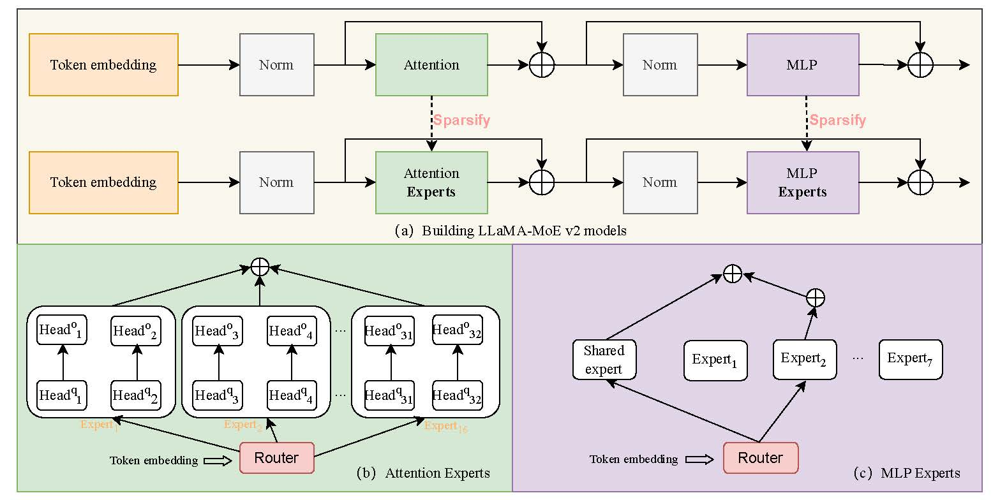
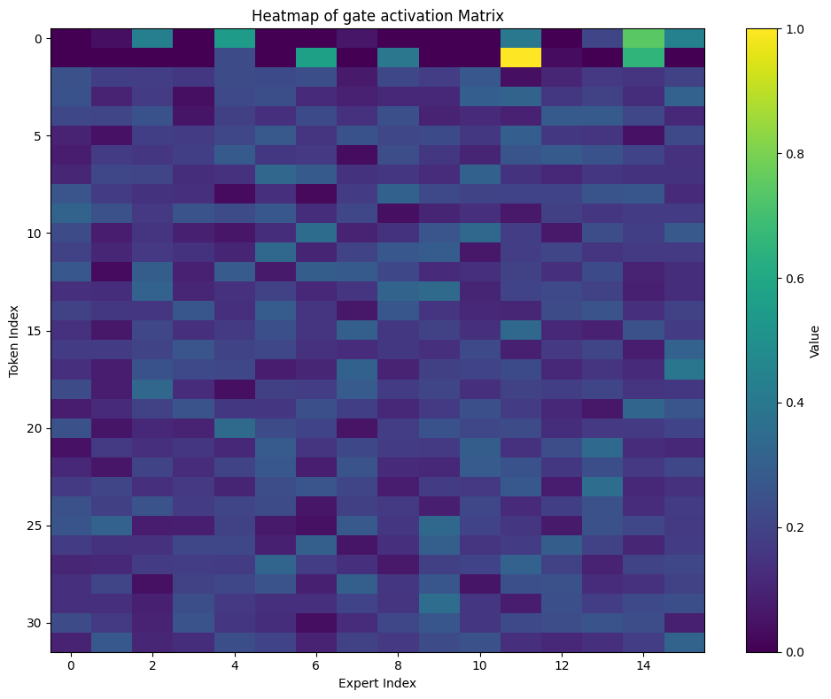
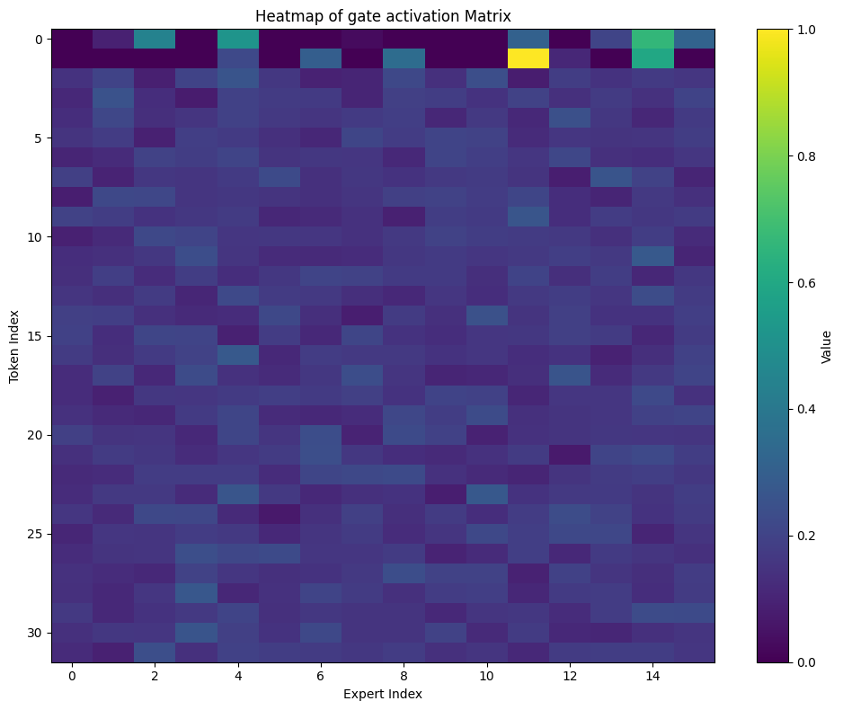

# Distributed Training for Mixture of Expert Report

### 1) Introduction

Mixture of Expert is the technique that uses many sub small models, we call as experts in order to improve the quality of the LLM model. With the development of the LLM, and the scaling in the number of tokens and the vocab size, which can increase the computing cost extensively, the Mixture-of-Expert (MoE) is the suitable way to help scale down the context length of the model. Previous works propose the approach to integrate the Mixture of Expert to the weight of the Feedforward layer, and also the Attention weight, and gain some promissing results. Although the promissing of previous works, the chosen of the training resources, and the effect of the experts in the overall LLM models are not explored, which can make the difficult for the clients to choose the suitable computing resources for training a LLM-MoE model, or choosing the suitable parameter for the training, which can also ensure the quality and their training budget. For this reason, in this research work, in order to understand the current MoE application in LLM and the computing resources requirements for the MoE-LLM, we do some evaluation for the distributed training of the MoE model on 3 hardware types are A100, H100, and TPUs. Additionally, we also do some interpretion for the model to explore the effect of the different experts and their correlation in each knowledge domain. 

My main contribution in this work includes three folds:

- Explore the effect of the Mixture of Expert in the training LLM model.

- I do the benchmark of the distributed training of the LLM-MoE model on different devices (test on LLama-MoE)

- I do the interpretation to explore the effect of the different experts and their correlation in each knowledge domain. 

The remaining of this reports is presented as following:

2) Related Work

3) Experimental Detail

4) Experimental Results and Analysis

5) Conclusion and Discussion

6) Future work

### 2) Related Work

In this research, I conduct the experiments based on the Llama-MoE-V2 architecture, which is proposed by Qu et al. in the paper LLaMA-MoE v2: Exploring Sparsity of LLaMA from Perspective of Mixture-of-Experts with Post-Training at ACL 2024. For the overal architecture, it is showed below:

    

Where the experts are integrated to the attention weight, and also in the MLP layer of the Feed Forward module.

Regarding the flow, the input text tokens is embedded as the token embedding, then through the normalization, the attention experts, and feed forward experts, it will produce the output embedding for the answers, which can be then post-processed and detokenized to the final answer in text.

During the training, firstly, we need to convert the original into the mixture of expert model. The weight of the model will be copied, however, with the attention weight, the weight for key, query and value will be splitted into n experts with the initialization follow the Xavier method, and a router is added before that. Similarly, in the feed forward layers, the feed forward weight will be converted in to n experts with the xavier initialization and the router. From this, we will do the supervised fine-tuning in order to do the tuning for all experts weight and the activated weight of the model, thus make these weight updated follow the distribution of the training data.

### 3) Experimental Detail

#### 3.1) Datastet

**Training resource benchmark dataset**: To conduct the experiment, we set the training experiments on the [OpenHermes2.5 dataset](https://huggingface.co/datasets/teknium/OpenHermes-2.5/tree/main), this dataset consists of 1001551 samples of conversations primarily synthetically generated from instruction and chat samples, following the ShareGPT structure. This dataset is combined across different data sources, and it is used to train the LLama-2 model.

**Intepretation test dataset**: For the testing dataset, we use the Med-QA Alpaca, and mathqa dataset for testing the interpretation of the model. PiQA data set is the dataset that contains samples, which is mentioned about the topic. While the mathqa dataset consists of samples, which is the relevants questions and answers for the mathematic domain.

#### 3.2) Hyperparameter

To benchmark the training process, we conducted the fully supervised Finetuning experiments on the LLama-MoE-V2 model, which is activated 2 experts over 8 experts from the LLama-3 8B model. The activated parameters of this model is about 3.8B. For the training, we use the Adam optimizer, with a learning rate is about 1e-4, and the batch size per gpu is 1. For the training, data, the weight of the model, gradient, and momentum will be stored on the GPUs for the calculation. The max token lengths in the experiments is set at about 2048 token lengths per sample to facilitate the training on our small amount of GPUs. 

For the computing resources, we did experiments on four settings are 4 H100 GPUs, 4 A100 GPUs, 2 A100 GPUs, and 2 H100 GPUs, all of the hardware has a virtual ram of about 80GB.

### 4) Experimental Results and Analysis

#### 4.1) Distributed training results
From the experiments, we did some benchmarks related of the distributed training of the LLama-MoE-V2 on different GPUs. The table below shows the evaluation of the results in the different GPUs setting

| GPUs Usage | Number of steps | Training time per step (second) | Total training time | Average GPU Utilization | Average GPU memory usage|
| ------------- | ------------- |  ------------- |  ------------- |  ------------- |  ------------- |
| 4 x H100 80GB   | 20000  | 5.25 | About 29 hours |  ~ 82% | 73GB |
| 4 x A100 80GB  | 20000 | 8.1 | About 42 hours | ~ 100% | 73GB |
| 2 x A100 80GB  | 20000 | None | None | OOM | OOM |
| 2 x A100 80GB  | 20000 | None | None | OOM | OOM |

From the benchmark of the distributed training results, we can observe that, with the requirements to train an MoE model with about 3.8B activated parameters the number of gpus higher than 2 two do the distributed of the model weight, gradient, and also momentum across gpus. From this observation, we can claim that, with the company or startup, if they want to conduct the training experiment with the model MoE-LLM, it is necessary to prepare the server with at lease 4 GPUs of 80GB VRAM to support the training.

#### 4.2) Interpretation results

To assess the effect of the experts in the different doing Interpretation, we have the following results:

- Result on the Medical-QA dataset

    

- Results on Math-QA dataset

    

As can be observed, we can see that, at some of the first tokens of the dataset, each experts share the low importance to the group of tokens. However, when we go to the further group of tokens, the importance of each experts in each tokens groups are different. Some has the major contributions, while some has little contributions. Moreover, we can see that, the difference dataset will also show the different results, thus we can claim that the hyperparameter and the number of gate can affect to the overall result of the model, so it is important to choose the best optimized number of experts (as the hyperparameter).

### 5) Conclusion and Discussion
In conclusion, in this research, we conduct the experiments to measure and evaluate the on the MoE applications on the Large Language Model. From the experiment, we can see that the training of the Large Language Model with the Mixture of Expert setup need at least 320 GB VRAM of the virtual memory of the GPUs to support the training. Beside that, we do the intepretation for the importance of the experts, and we can see that, for each knowledge domains, the experts activation has the differences, which showcases the choice for number of activated experts is very important, which should be explore further by the later research. Finally, after this project, I earned the knowledge and the general insight about the Mixture-of-Expert application in the Large Language Model, which can support me in the further research in building the model. In the future, I suggest the further works doing the architecture search to find and choose the best hyperparameter for the LLM-MoE models.

### 6) Future work
For the future work, we aim to do the open-source and benchmark the training of the Llama-MoE model on the TPU, which support the larger range of the computation resources. Beside that, after researching and understanding the MoE architecture on the LLM, we have the design and planning to do the implementation and improve for the further research on the Multimodal-LLM.

### Reference

1. Qu, Xiaoye, et al. "Llama-moe v2: Exploring sparsity of llama from perspective of mixture-of-experts with post-training." arXiv preprint arXiv:2411.15708 (2024).

2. Zhu, Tong, et al. "Llama-moe: Building mixture-of-experts from llama with continual pre-training." Proceedings of the 2024 Conference on Empirical Methods in Natural Language Processing. 2024.

3. Teknium, OpenHermes 2.5: An Open Dataset of Synthetic Data for Generalist LLM Assistants, HuggingFace, 2023.

4. Gao, Leo and Tow, Jonathan and Abbasi, Baber and Biderman, Stella and Black, Sid and DiPofi, Anthony and Foster, Charles and Golding, Laurence and Hsu, Jeffrey and Le Noac'h, Alain and Li, Haonan and McDonell, Kyle and Muennighoff, Niklas and Ociepa, Chris and Phang, Jason and Reynolds, Laria and Schoelkopf, Hailey and Skowron, Aviya and Sutawika, Lintang and Tang, Eric and Thite, Anish and Wang, Ben and Wang, Kevin and Zou, Andy, A framework for few-shot language model evaluation, Zenodo, 2024.

5. Han, Tianyu, et al. "MedAlpaca--an open-source collection of medical conversational AI models and training data." arXiv preprint arXiv:2304.08247 (2023).
